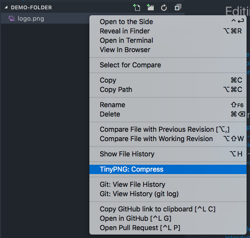
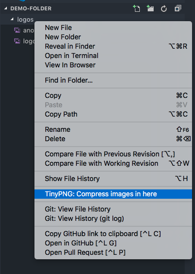
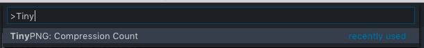

# TinyPNG API VSCode Extension

This extension uses the API provided by[TinyPNG](https://tinypng.com/developers) to compress your JP(E)G and PNG images directly inside VSCode!

## Features

### Compression of single files

Inside the file explorer, use the entry in the context menu to compress a single file.

### Compression of folders

As an addition to compress single files you can also compress all images inside a complete folder — including subfolders — aswell!

Select a folder and press the corresponding TinyPNG context menu entry.

## Requirements

You need to have an active TinyPNG API key, which you can find in your [TinyPNG Developer Dashboard](https://tinypng.com/dashboard/developers). You can provide the API key in your settings, see below.

_!!!Be aware of [TinyPNG API](https://tinypng.com/developers)'s pricing model! All compressions you do via this extension are counting in your account's compression count! You can see your currently and monthly compression count via command you can see below or inside the dashboard!!!_

## Extension Settings

This extension contributes the following settings:

-   `tinypng.apiKey`: Your own TinyPNG API Key

## Known Issues/Limitations

Currently not supported API features are:

-   Image resizing
-   Preserving metadata
-   Saving compressed images to Amazon S3.

_Note: This extension uses the TinyPNG own NodeJS [Tinify API client](https://github.com/tinify/tinify-nodejs). Thus issues you might notice in the extension are actual issues of this library._

## Release Notes

Release notes can be found in the [changelog](./CHANGELOG.md).

**Enjoy!**
